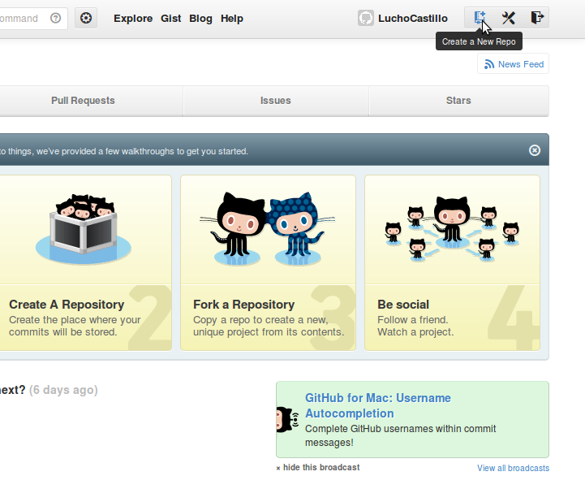

# Como crear un nuevo repositorio en hithub

## Como crear un nuevo proyecto en github

touch README.md
git init
git add README.md
git commit -m "comentario"
git remote add origin https://github.com/LuchoCastillo/Repositorio.git
git push -u origin master

## Como subir un proyecto

git add archivo
git commit -m "comentario"
git push

*nota: Es importante realizar los 3, ya que si no se ingresa un comentario, no se realiza el cambio.

